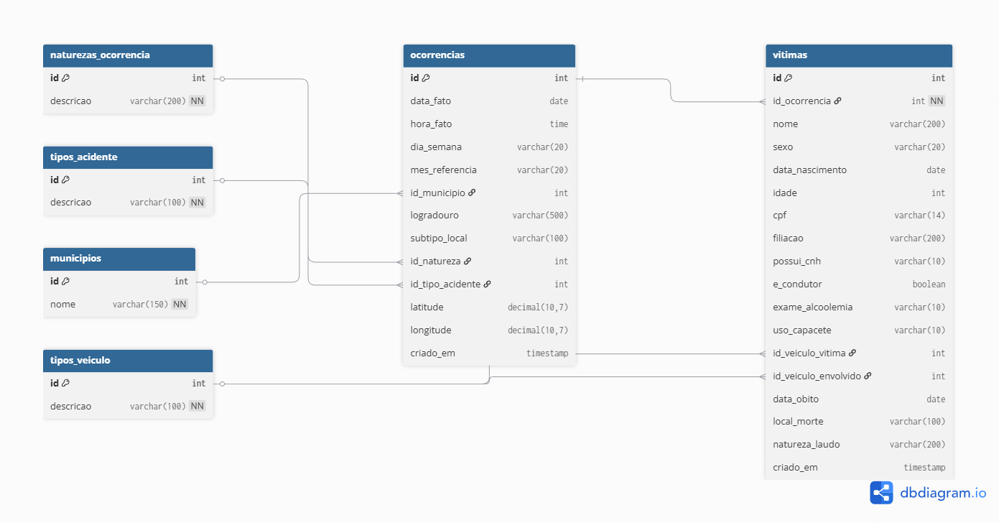

# Sistema de Cadastro de Mortes no Transito

Aplicacao desktop em Python com PyQt6 para cadastrar mortes no transito, com suporte para **Excel Local** ou **Google Sheets** em tempo real, e sincronizacao com **MySQL**.

## Caracteristicas Principais

- Interface grafica moderna e intuitiva com PyQt6
- **Dois modos de operacao**:
  - **Excel Local**: Trabalhe com arquivos .xlsx offline
  - **Google Sheets**: Atualizacoes em tempo real na nuvem
- Formulario com 29 campos ativos organizados em 7 abas
- Calculos automaticos de idade, dia da semana e mes
- Validacao de dados em tempo real
- Insercao ordenada automatica por Data do Fato
- **Sincronizacao com MySQL**

## Modos de Operacao

### Excel Local
- Trabalhe offline com arquivos .xlsx
- Controle total sobre seus arquivos
- Download manual da planilha atualizada

### Google Sheets
- **Atualizacao instantanea** na nuvem
- Acesso de qualquer lugar
- Compartilhamento facilitado com equipe
- Sem necessidade de download

## Requisitos

- Python 3.10 ou superior
- MySQL 8.0 ou superior
- Windows, macOS ou Linux
- Conexao com internet (apenas para modo Google Sheets)

## Instalacao

### 1. Clone o projeto

```powershell
git clone https://github.com/mateus-pcosta/mortes-transito.git
cd mortes-transito
```

### 2. Instale as dependencias

```powershell
pip install -r requirements.txt
```

**Dependencias incluidas**:
- PyQt6 (interface grafica)
- pandas (manipulacao de dados)
- openpyxl (Excel local)
- gspread + google-auth (Google Sheets)
- mysql-connector-python (MySQL)
- python-dotenv (variaveis de ambiente)

### 3. Configure o banco de dados MySQL

```powershell
Get-Content setup_database.sql | mysql -u root -p
```

Isso cria o banco `mortes_transito` com todas as tabelas e dados iniciais.

### 4. Configure o arquivo .env

Copie o exemplo e preencha com suas credenciais:

```powershell
Copy-Item .env.example .env
```

Edite o `.env` com seus dados de acesso ao MySQL.

## Planilha Excel

O projeto inclui o arquivo `planilha_mortes_transito.xlsx` com as 29 colunas ja configuradas, pronto para uso.

O sistema tambem aceita planilhas com 33 colunas (formato antigo). Nesse caso, as 4 colunas extras (N de BOS, N de Vitimas, N Laudo IML, N do BO) sao removidas automaticamente ao carregar.

### Colunas da planilha (29)

| # | Coluna |
|---|--------|
| 1 | Natureza da Ocorrencia |
| 2 | Tipo de Acidente |
| 3 | Natureza do Laudo |
| 4 | Data do Obito |
| 5 | Vitima |
| 6 | Sexo |
| 7 | Filiacao |
| 8 | Data de Nascimento |
| 9 | Idade |
| 10 | CPF |
| 11 | Possui CNH |
| 12 | Condutor |
| 13 | Realizado Exame Alcoolemia |
| 14 | Estava usando Capacete |
| 15 | Municipio do Fato |
| 16 | Logradouro |
| 17 | Subtipo do Local |
| 18 | Lat |
| 19 | Long |
| 20 | Data do Fato |
| 21 | Hora do fato |
| 22 | Dia da Semana |
| 23 | Mes |
| 24 | Local da Morte |
| 25 | Veiculo Vitima Ou Outros |
| 26 | Veiculo Envolvido Ou Outros |
| 27 | Regiao |
| 28 | Territorio de Desenvolvimento |
| 29 | OBS: |

## Como Usar

### Execute a aplicacao

```powershell
python main.py
```

### Escolha o Modo

Na tela inicial, escolha entre:

1. **Arquivo Excel Local**
   - Clique em "Selecionar Arquivo Excel"
   - Escolha seu arquivo .xlsx
   - Cadastre normalmente
   - Baixe a planilha atualizada

2. **Google Sheets Online**
   - Clique em "Conectar ao Google Sheets"
   - Configure credenciais (primeira vez)
   - Insira URL da planilha
   - Cadastros sao salvos instantaneamente

### Preencha o Formulario

O formulario esta organizado em 7 abas:

- **Boletim** - Natureza da Ocorrencia e Tipo de Acidente (demais campos desativados)
- **Laudo** - Natureza do Laudo (N Laudo IML desativado)
- **Vitima** - Dados da Vitima
- **Localizacao** - Localizacao do Acidente
- **Data e Hora** - Data e Hora do Fato
- **Veiculos** - Veiculos e Local da Morte
- **Territorial** - Classificacao Territorial

## Banco de Dados MySQL

O banco `mortes_transito` possui 6 tabelas com chaves primarias e estrangeiras:



## Campos Calculados Automaticamente

- **Idade**: Calculada a partir de Data de Nascimento e Data do Obito
- **Dia da Semana**: Calculado a partir da Data do Fato
- **Mes**: Calculado a partir da Data do Fato

## Campos Obrigatorios

1. Natureza da Ocorrencia
2. Tipo de Acidente
3. Data do Obito
4. Vitima (Nome Completo)
5. Sexo
6. Municipio do Fato
7. Data do Fato

## Estrutura do Projeto

```
projeto/
|
|-- main.py                       # Inicializacao
|-- requirements.txt              # Dependencias
|-- setup_database.sql            # Script de criacao do MySQL
|-- planilha_mortes_transito.xlsx # Planilha modelo (29 colunas)
|-- README.md                     # Este arquivo
|-- .env.example                  # Template de variaveis de ambiente
|-- .gitignore                    # Arquivos ignorados pelo git
|
|-- interface/                    # Interfaces graficas
|   |-- tela_selecao_modo.py     # Escolha Excel/Sheets
|   |-- tela_cadastro.py         # Formulario (7 abas)
|   |-- tela_confirmacao.py      # Confirmacao
|
|-- utils/                        # Utilitarios
    |-- excel_handler.py          # Handler Excel
    |-- sheets_handler.py         # Handler Google Sheets
    |-- database_handler.py       # Handler MySQL
    |-- validacoes.py             # Validacoes
    |-- calculos.py               # Calculos automaticos
    |-- dados_estaticos.py        # Dados pre-definidos
```

## Seguranca

- Credenciais armazenadas em `.env` (nunca commitado)
- Arquivo `credentials/` protegido pelo `.gitignore`
- Senhas e chaves privadas nunca expostas no repositorio

## Configuracao do Google Sheets

Para usar o modo Google Sheets:

1. Criar um projeto no Google Cloud Console
2. Ativar Google Sheets API e Google Drive API
3. Criar uma Service Account
4. Baixar arquivo de credenciais JSON para `credentials/`
5. Compartilhar planilha com o email da Service Account

---

**Versao**: 3.2 (Publica)
**Ultima atualizacao**: Fevereiro 2026
**Desenvolvido com**: Python 3, PyQt6, pandas, openpyxl, gspread, MySQL
